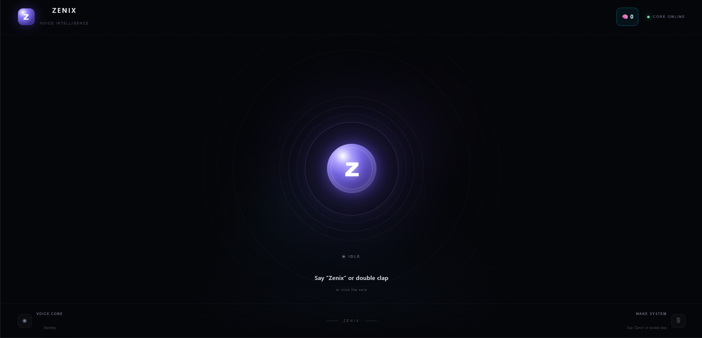
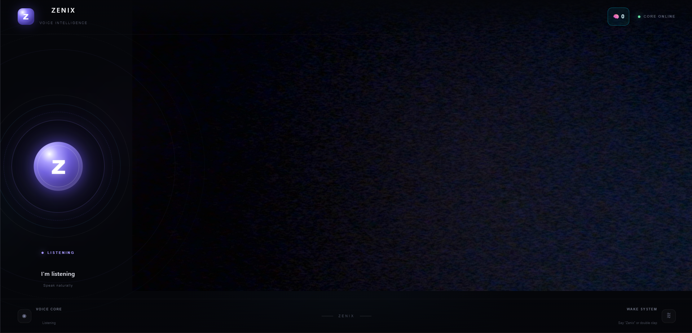
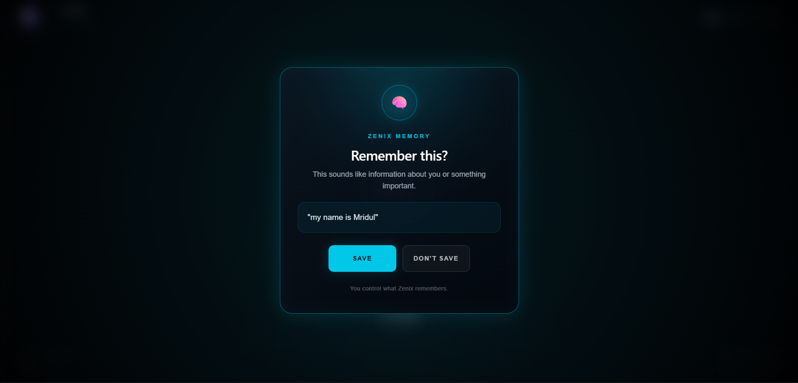

# 🤖 Zenix AI Assistant

**Zenix** is a full-stack AI voice assistant built with **React and FastAPI**.

The goal of Zenix is to create a personal AI assistant capable of natural voice interaction, persistent memory, camera control, local commands, and eventually fully local AI-powered responses and computer automation.

> 🚧 Zenix is currently under active development.

---

## ✨ Features

- 🎤 Voice input using speech recognition
- 🔊 Text-to-speech responses
- 🗣️ Wake-word interaction
- 🧠 Persistent memory system
- 📷 Camera control using voice commands
- ⚡ Local command handling
- 🌐 React frontend
- 🐍 FastAPI backend
- 🔗 REST API communication
- 🤖 AI model integration
- 💻 Local LLM integration with llama.cpp — In Progress

---

## 🧠 What Can Zenix Do?

Zenix is being designed as more than a traditional chatbot.

Examples of supported or planned interactions include:

```text
"Zenix"

"Open camera"

"Take a picture"

"Close camera"

"Remember that I prefer Python"

"Be attentive"

"Shutdown"
```

The long-term goal is to allow Zenix to interact with the computer, understand visual information, remember useful information about the user, and operate using local AI models.

---

## 🛠️ Tech Stack

### Frontend

- React
- JavaScript
- CSS
- Web Speech API
- Browser Media APIs

### Backend

- Python
- FastAPI
- SQLite
- Pydantic
- REST APIs

### AI

- llama.cpp
- GGUF models
- Local LLM inference — In Progress
- Cloud AI APIs used during development

### Development Tools

- Visual Studio Code
- Git
- GitHub
- Postman

---

## 🏗️ Architecture

```text
             Voice / User Input
                     │
                     ▼
              React Frontend
                     │
                     ▼
              FastAPI Backend
                /         \
               /           \
              ▼             ▼
        Command Router    Memory
              │           SQLite
              │             │
              └──────┬──────┘
                     │
                     ▼
                   AI
              Local / Cloud
                     │
                     ▼
               Zenix Response
                     │
                     ▼
             Voice / Actions
```

The memory system is kept separate from the AI model so stored information can remain available even if the underlying model changes.

---

## 📂 Project Structure

```text
zenix-ai-assistant/
│
├── backend/
│   └── main.py
│
├── frontend/
│   ├── src/
│   │   ├── App.jsx
│   │   └── App.css
│   ├── package.json
│   └── ...
│
├── .gitignore
└── README.md
```

Large local AI models, databases, API keys, `node_modules`, and llama.cpp binaries are intentionally excluded from this repository.

---

## 🚀 Running Zenix Locally

### 1. Clone the Repository

```bash
git clone https://github.com/mridhuldev/zenix-ai-assistant.git
```

Move into the project:

```bash
cd zenix-ai-assistant
```

---

### 2. Start the Backend

```bash
cd backend
```

Install required Python dependencies.

Then start FastAPI:

```bash
python -m uvicorn main:app --reload --host 127.0.0.1 --port 8000
```

The backend will run at:

```text
http://127.0.0.1:8000
```

---

### 3. Start the Frontend

Open another terminal:

```bash
cd frontend
```

Install packages:

```bash
npm install
```

Start the development server:

```bash
npm run dev
```

The React application will normally run at:

```text
http://localhost:5173
```

---

## 🔐 Security

Sensitive and unnecessary local files are excluded using `.gitignore`.

The repository does **not intentionally include**:

```text
.env files
API keys
Local memory databases
GGUF AI models
llama.cpp binaries
node_modules
Python virtual environments
```

API keys should always be stored using environment variables rather than directly inside source code.

---

## 🧩 Current Development Status

### ✅ Implemented

- React interface
- FastAPI backend
- Frontend/backend communication
- Voice recognition
- Text-to-speech
- Wake interaction
- Camera opening
- Photo capture
- Camera closing
- Local voice commands
- Persistent memory system
- AI API integration

### 🔨 In Progress

- Local LLM integration
- llama.cpp integration
- Improved memory retrieval
- Improved command routing
- Faster local AI responses

### 🗺️ Planned

- Computer application control
- File and system commands
- Screenshot understanding
- Vision capabilities
- Fully offline speech recognition
- Local text-to-speech
- Advanced long-term memory
- Android companion application
- Phone commands
- Improved wake-word engine
- Fully local/offline operation

---

## 🎯 Project Goal

The long-term vision for Zenix is to build a personal AI system with the architecture:

```text
Wake Word
   ↓
Speech Recognition
   ↓
Zenix Command Router
   ↓
┌─────────────┬─────────────┬─────────────┐
│ Local Tools │   Memory    │  Local LLM  │
└─────────────┴─────────────┴─────────────┘
                    ↓
              Zenix Response
                    ↓
          Voice / Computer Action
```

Instead of relying entirely on external AI services, Zenix is gradually being moved toward a **local-first architecture**.

---

## 📸 Screenshots







---

## 🤝 Contributions

Zenix is currently a personal development project.

Suggestions, ideas, and feedback are welcome through GitHub Issues.

---

## 👨‍💻 Author

### Mridhul

Full-Stack Developer focused on building web applications and AI-powered software.

**Technologies:** React • JavaScript • Python • FastAPI • AI

GitHub: [@mridhuldev](https://github.com/mridhuldev)

---

## ⭐ Support

If you find Zenix interesting, consider giving the repository a ⭐.

It helps support the project as development continues.